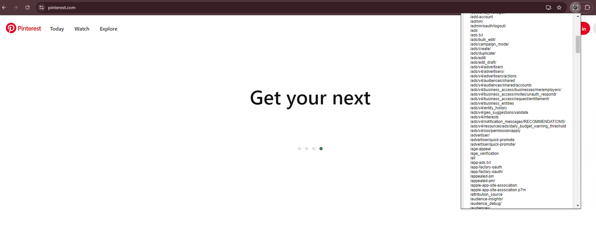

# 🌐 Linkfinder by Rdzsp 🔗

**Linkfinder by Rdzsp** is the superhero your browser never knew it needed! 🦸‍♂️🦸‍♀️ This awesome extension collects endpoints from JavaScript files on websites—so you don't have to. Whether you're a security researcher, a curious dev, or someone who just likes to peek behind the digital curtains, this extension has got your back! 💻🔍

## 🎯 Features

- 🔗 **Endpoint Hunter**: Finds and extracts endpoints from JavaScript files on websites.
- 💡 **Easy to Use**: Simple interface, no magic spells required. ✨
- 🏃‍♂️ **Fast & Lightweight**: Won’t slow down your browsing while doing all the heavy lifting.
- 🌍 **Multi-domain Support**: Works across websites like a boss.

## 🚀 Installation

### From Chrome Web Store (Coming Soon... 🎉)

_Or be an early adopter and manually install it:_

1. **Clone this repository:**

    ```bash
    git clone https://github.com/rdzsp/linkfinder-by-rdzsp.git
    ```

2. **Load it into Chrome:**
    - Open Chrome and go to `chrome://extensions/`.
    - Enable "Developer mode" in the top right corner. (You’re basically a dev now! 👨‍💻👩‍💻)
    - Click "Load unpacked" and select the folder where you cloned this repo.
  
3. **Boom!** 💥 The extension is now live!

## 📸 Screenshots

Here's a sneak peek at what you’re getting into:


*Doing its thing, finding endpoints like a pro.*

## 📺 Video Tutorial & Showcase

Need a little more guidance? 🧑‍🏫 Check out our Youtube Tutorial to get started or watch the showcase video to see it in action.
[](https://youtu.be/jv_-mSGg9SE)

## 🌟 Show Some Love

If you like what you see, hit that **Star** ⭐ button on GitHub! We thrive on stars. It’s like caffeine for our project. ☕✨

[](https://github.com/rdzsp/linkfinder-by-rdzsp/stargazers)

<details>
  <summary>⭐ Star History</summary>
  
</details>

## 🛠 Contributing

Have some ideas to make this even better? Or maybe you’ve found a bug (eww, bugs 🐛)? Contributing is easy, and we welcome all sorts of help!

### How to Contribute:

1. Fork the repository 🍴.
2. Create a new branch (e.g., `feature/cool-idea`) 🌱.
3. Commit your changes, and open a pull request 📝.
4. Pat yourself on the back for being awesome 🎉.

## ⚖️ License

Licensed under the MIT License. Because we believe in freedom and open source. 💪 See the `LICENSE` file for more details.

## 🚨 Disclaimer

This tool is intended for educational and research purposes only. Be cool, and don’t use it on websites without permission. 🙏 Respect the web!

---

Made with ❤️ by [Rdzsp](https://github.com/rdzsp).